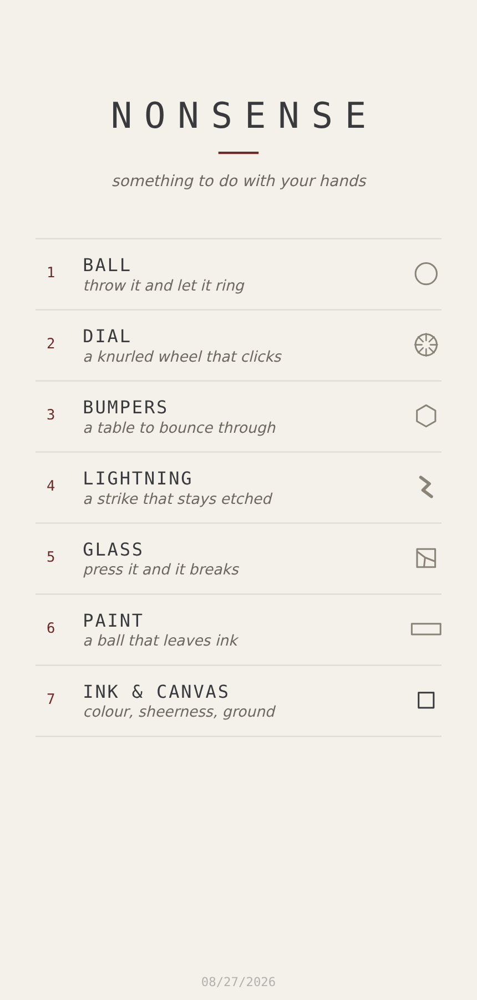
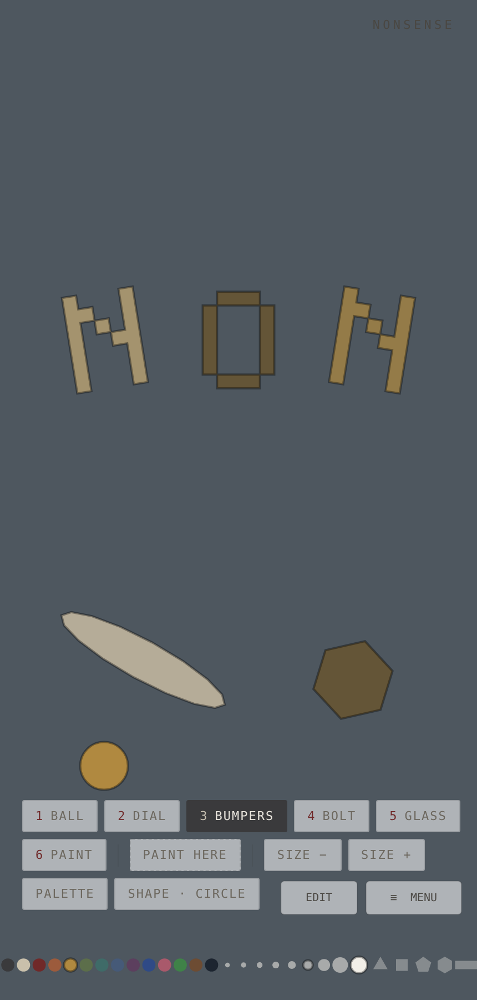
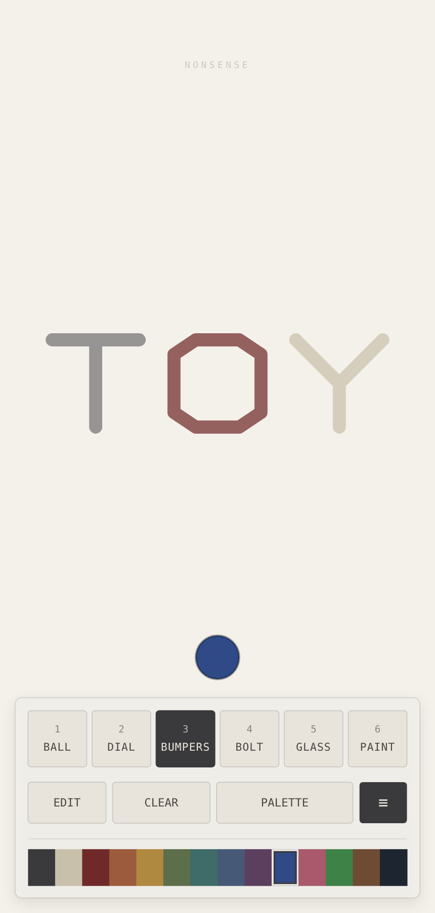
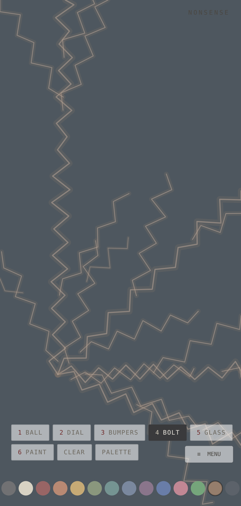
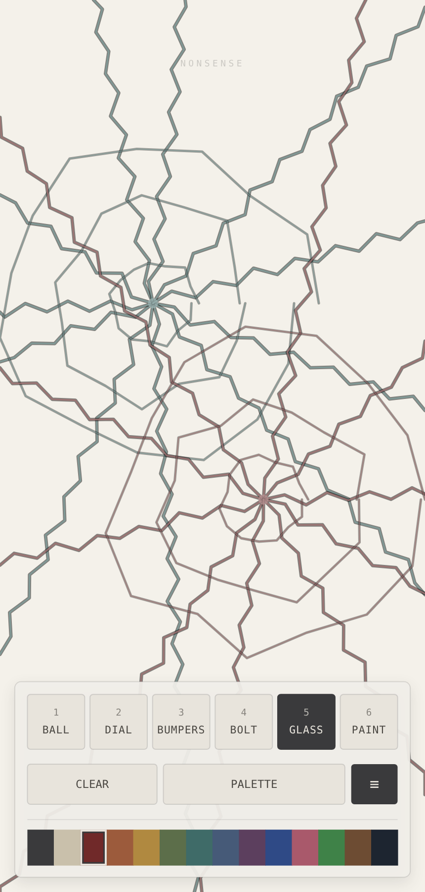
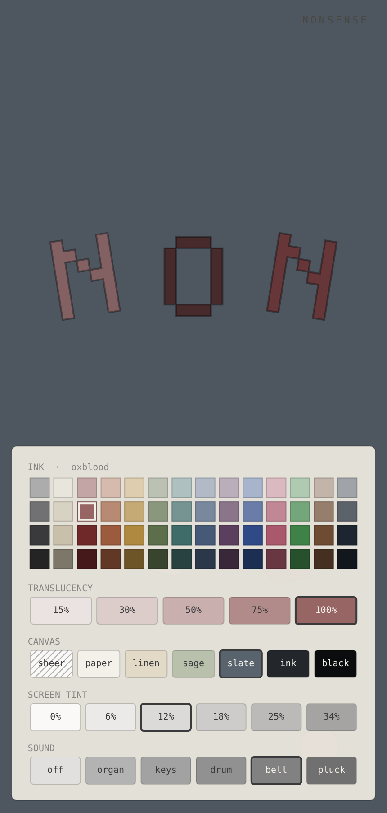

# Nonsense

A sheer, full-screen surface for messing about. While the app is open, the whole screen is
the toy — flick a matte ball around, spin a dial, or throw lightning at the walls. A tint over a translucent
window means you can still see the screen (and incoming notifications)
underneath; how sheer it is, is yours to set. Exit like any normal app and your
device is back.

No scores. No skins. Not for children. Just quiet, mindless flicking — with
sound if you want it, and off until you do.

**[Play it in a browser](https://chermen74.github.io/nonsense/play/)** — nothing
to install, works on a phone. On iOS, *Share → Add to Home Screen* gives it its
own icon and the whole screen.

**[Download the Android APK](https://github.com/chermen74/nonsense/releases/download/android-debug/app-debug.apk)**
— open that link on the phone and tap it; Android asks once whether to allow
installs from your browser. It is a debug build signed with the throwaway key
in this repo, rebuilt by CI on every push. (GitHub does not show Releases on
its mobile layout, which is why this link is here rather than only in the
sidebar.)

| | | |
|:--:|:--:|:--:|
|  |  |  |
| The front door | A word, spelled in bumpers | …one palette tap later |
|  |  |  |
| One flick of lightning | Glass, pressed twice | The palette drawer |

Every one of those is the browser build, shot at phone size by
`tools/`-style Playwright scripts rather than cropped by hand — the same page
you can open from `web/index.html`.

## The front door

It opens on its own name and a list of what it can do. None of the toys
announce themselves from the inside — a field with a ball in it looks the same
whether or not it will let you paint — so the menu is where they are named,
each with a line saying what it is.

It is a hairline-ruled list rather than a stack of cards. Seven grey rounded
cards gave every toy the same heavy weight and ate a gutter on both sides;
rules let the type carry the hierarchy — an oxblood numeral, the name in
tracked mono, the description in italic sans, which is the one italic on the
screen and reads as annotation rather than as another control.

The **≡** button at the right of the dock (and `Esc` on a keyboard) goes back
to it. Whichever toy you left running is remembered; you still come back
through the front door.

## The dock

One panel at the foot of the screen, holding three tiers. It replaced three
loose rows of identical chips: the six toys, the palette, the menu and
whichever toggle the mode had were all the same size in the same grey, so
nothing told the eye what mattered — and the options for the five toys you
were **not** holding sat there taking a row of their own.

- **Tier one — the tools.** Six tiles, numeral above name. The one you are
  holding is filled graphite. This is the loudest thing on the screen after
  the toy itself, because choosing a toy is the decision you make most.
- **Tier two — what that tool can do.** A pure function of the mode, which is
  what removed the third row rather than shrinking it: the ball gets shape,
  size, catch and the palette; lightning gets clear and the palette; and so
  on. Chips are shared by the length of what they say, so every one of them
  keeps the same size of type. The **≡** menu is pinned to the right at a
  fixed size, out of the chip flow — it is not a tool and should not compete
  with them.
- **Tier three — the ink.** Fourteen families, flush, as one ribbon rather
  than a row of buttons. Thirty-four points tall, where the old strip was
  about sixteen and effectively un-hittable one-handed. Tapping the family you
  are already on opens the whole palette, which is what the strip always did.

The play field is measured from the dock rather than guessed, so the two
cannot drift — and because the dock is shorter than the three rows it
replaced, the canvas is **bigger** than it was.

## Six toys, identical everywhere

- **Ball** — touch anywhere; the ball comes to your finger. Flick to send it
  coasting. It bounces off screen edges (haptic tap on impact, Android only)
  and slows with friction. Eight sizes and six shapes — see below. Turn on
  **catching** and it stops coming to you: you have to land on it.
- **Dial** — a knurled wheel, centre screen. Eighteen ribs, one of them marked
  so a turn stays countable, and a red index at the top that the ribs click
  past. Drag around its centre to spin, release to let it coast — about twenty
  seconds from a hard flick. On desktop the scroll wheel spins it from
  anywhere. See **the dial** below for the two things that used to stop it
  dead.
- **Bumpers** — the ball plus a table of outline bumpers in a loose pinball
  layout. Each hit reflects the ball with a small kick (capped, so it can't
  run away) and a haptic tap. The table is yours to arrange, and the ball can
  paint while it plays — see below.
- **Lightning** — flick anywhere and a bolt leaves your finger, spreading into
  forks as it goes. It knocks when it reaches a wall and then stays there,
  etched onto the scene in the ink you threw it with. Flick again and the
  scene builds up. Nothing to arrange and nothing to hold: it is the one toy
  that is only ever a throw. See **lightning** below.
- **Glass** — press anywhere and the pane breaks under your finger: radial
  fractures out to the edges and a few rings around the impact, in whatever ink
  you chose. Presses build up until you sweep them. See **glass** below.
- **Paint** — the ball leaves a trail wherever it goes, flicked or dragged.
  A quiet strip along the bottom edge: the fourteen colour families, eight ball
  sizes and six ball shapes. Two-finger tap (Android) or
  `C` (desktop) clears the canvas. Traces float over the sheer scrim, so
  the picture hangs over whatever's behind it.
- **Double-tap** (Android) / **Tab** (desktop) cycles modes; `1`–`6` jumps
  straight to one on desktop (they pick a bumper shape while editing).

## The dial

It used to be a plain disc with a single dot on it, and it never looked like it
was turning, for three reasons — all now fixed:

- **There was nothing on it to watch.** One dot at 0.8r is not motion. It has
  eighteen ribs now, drawn from the hub to the rim, one of them in a darker
  tone so you can count revolutions.
- **The friction was wrong.** `0.35` per second sheds two thirds of the speed
  every second: it was practically still before you had finished letting go.
  It is `0.78` now, which is roughly a twenty-second run-down.
- **The release speed was read from the last drag sample.** A finger nearly
  always stalls for a frame or two before it lifts, so a hard flick was handed
  back a wheel at rest. Speed is taken over a 120ms window instead — the same
  trick the ball's flick already used.

Top speed is capped at 14 rad/s. That is deliberate rather than defensive: at
eighteen ribs it works out to forty rib passes a second against a screen that
redraws sixty times, and any faster and the knurl stops turning and starts
crawling backwards. At speed the ribs are also drawn wider and fainter, so a
fast spin blurs instead of strobing.

## Lightning

A flick throws a bolt. It spreads as it goes, arrives at a wall, and stays
there: the path is etched onto the scene, and the scene builds up strike by
strike until you wipe it.

- **It carries your flick.** Direction and speed both come from the throw, at
  2× the measured velocity and capped at 9000px/s. The same 120ms velocity
  window the ball and the dial use — the last drag sample is a stalled finger,
  not a throw. Below 420px/s it is a tap and nothing happens; there is no
  object on screen at rest, so a press that does not travel does nothing.
- **It fans out from your finger.** Three to nine arms leave at once, spread
  across a cone centred on the throw. **The harder you flick, the more arms**
  — and since every arm that reaches a wall is its own impact, a hard throw is
  felt as a volley of knocks rather than a single tap.
- **It leans away from a wall it is thrown at.** Without that, a flick near an
  edge met a wall in a tenth of the screen and died there, so lightning only
  ever looked like lightning when it was thrown from the middle. A corner
  strike now crosses three quarters of the screen. The lean fades to nothing
  once you are clear of the edges, so a throw from open field goes exactly
  where you aimed it.
- **It fragments and thins.** Roughly one kink in five throws a fork, off to
  the side the kink itself threw and never by less than about sixteen degrees.
  A fork is slower than its parent, drawn a quarter lighter, and can fork twice
  more — so the trunks are heavy near your finger and the tips are hairlines.

  It fragments **and thins**, and getting only the first half of that wrong was
  worth a photograph. When the fan went in, every fork inherited the rule
  "travel until you hit a wall" — so all of them crossed the screen, and one
  flick left about forty full-length streaks: fourteen screen-diagonals of ink,
  a scribble rather than a strike. The tell was that a *soft* flick left as
  much as a hard one. Forks now carry a **reach budget** that halves each
  generation: the stroke your finger threw still runs to the wall, and
  everything leaving it is a spark that stops where it runs out. Branching
  thins with depth too, or three arms become forty paths. One flick now leaves
  four to seven screens of ink depending on how hard you threw it, and both
  suites hold the line — total ink, path count, and "each generation's longest
  path is shorter than the last" are all assertions.
- **The wall is the end of the journey, not a cushion.** It arrives, knocks —
  a haptic weighted like the ball's, through the same code — and stops. It
  used to ricochet a dozen times, which made it a ball with a zigzag drawn on
  it.
- **Then it is etched.** The path stays exactly where it landed, cooled to a
  little over half brightness, in the ink it was thrown in. A hundred and
  twenty of them are kept before the oldest is rubbed out.

**Every strike keeps its own colour.** The ink is read at the moment of the
strike rather than at drawing time, so changing the palette afterwards leaves
the scene alone and the next flick lands in the new colour. Lightning is the
one toy whose bottom strip is nothing but the palette, full width — there is
no ball there, so ball sizes and ball shapes would be controls for nothing.
The fourteen families and four tones all work, and so does the drawer.

Wipe it with **clear** in the browser, `C` on a keyboard, a two-finger tap on
Android, or the **CLEAR** button on iOS.

The zigzag is part of the simulation, not the drawing, which is what makes it
testable and identical on all three builds: a node is laid every 4.5% of the
short edge, displaced perpendicular to travel, and the displacement
**alternates sign**. That last word is the whole trick. A random sign is a
random walk, and a random walk wanders — the first version read as a wobbly
rope. Alternating the side and randomising only the magnitude gives the sharp
back-and-forth a spark actually has. The forks follow the same rule: a
uniformly random turn puts most of them within a few degrees of their parent,
which draws parallel streaks rather than a tree.

Nodes are seeded from a small integer generator shared literal-for-literal
across Kotlin, Swift and JavaScript, so a bolt thrown the same way is the same
bolt everywhere, fork for fork. (Kotlin's `Int` wraps on overflow and Swift's
traps, so the Swift port uses `&*` and `&+` — there is a test that says so.)

A bolt is drawn in three passes — a wide dim wash, a darker sheath, then a
bright filament. The sheath is not decoration: on the paper canvas a white
hairline is invisible, and without something dark immediately around it the
bolt read as a hollow outline. A live strike's filament is nearly white; a
cooled etching's keeps its hue, because the colour is the point of the toy and
a near-white core washes it out.

## Glass

Press and it breaks where you pressed. Seven to thirteen radial fractures run
from the impact out to the edges of the pane, and two to four rings sit around
it — which is how glass actually goes: the radials first, then the concentric
cracks the shock wave leaves.

**The colour is the exposed edge.** Each crack is drawn twice: a dark seam,
which is the gap, and beside it — offset by a couple of thousandths of the
screen — a bright line in the ink you chose. That pair is the whole illusion,
a fracture face catching the light against the dark of the crack itself. Pick
a different ink and the next press breaks in that colour; the ones already
there keep theirs.

A crack is the same machinery as a bolt's zigzag: nodes laid once and never
moved, from the same shared generator, so a press breaks identically on all
three builds. The jag is much smaller — `0.34` against lightning's `0.9` —
because a fracture runs nearly straight, and the difference between nearly and
exactly is the whole look of it. Cracks stop at the edge of the pane rather
than running past it, and there is a test that says so from all four corners.

Fourteen panes are kept. **C**, a two-finger tap on Android, or the **CLEAR**
button sweeps up.

## Catching (ball mode)

Off by default, because the ball coming to your finger is the toy's resting
character. Press `G`, or the **catch** button in the browser build, and ball
mode turns into something you have to be accurate at:

- A press only grabs the ball if it lands on it. Miss and the ball carries on;
  a ring fades where you reached. No sound, no score, no penalty — just enough
  to tell you the ball wasn't there.
- A catch **holds the ball where you caught it**. It does not snap to the
  cursor: that would undo the catch you just made. Drag carries it by the
  offset you grabbed it at, and release throws it as always.
- Catching is measured against the ball's real outline, so a bar is caught
  along the bar and missed across its narrow side at the same reach.
- Small balls get slack, big ones don't: the tolerance is
  `max(0, 20 − radius × 0.35)` px, so a bead is a forgiving 18px target and a
  grapefruit you simply have to hit.

Only ball mode. Bumpers and paint still bring the ball to your finger — the
table and the canvas are about the ball's path, not about grabbing it.

## The ball: eight sizes, six shapes

The ball is no longer just a medium graphite circle. It comes in eight sizes —
0.12× to 2.1× the base radius, a bead through to a grapefruit — and six shapes:
**circle, triangle, square, pentagon, hexagon, bar**. Both apply in every mode
that has a ball (ball, bumpers, paint), not just in paint.

- `[` and `]` step the size down and up. The two smallest are properly small;
  motion substepping is scaled to the radius so even a bead at 4000px/s still
  registers a bumper.
- `S` cycles the shape, `Shift+S` goes back.
- The scroll wheel resizes the ball in ball and bumpers (it still spins the
  dial in dial mode).
- On a phone, size and shape are chips in the dock's second tier, which
  changes with the tool you are holding.

A non-round ball **tumbles**. Every impact imparts spin from the tangential
part of the blow, so a bar cartwheels off a wall and a square clatters through
the bumpers. Spin decays on its own and stops dead while you're holding it.

Shapes are convex outlines on a unit circumradius, shared with the bumpers, so
"size" means the same thing whatever shape is wearing it. Collision handles
every pairing: circle/circle analytically, circle/polygon by nearest edge, and
polygon/polygon by separating axis. Motion is substepped — a fast flick is
resolved in up to sixteen slices per frame — so nothing tunnels through a wall
or skips a bumper, and contacts are caught shallow enough to bounce sensibly.

Wall bounces use the ball's real outline rather than a circle drawn round it,
and only reverse the velocity when the ball is actually heading into the wall.
Without that second test a corner that rotates back into contact flips the
velocity twice and pins the ball to the edge.

When painting, the trail width follows how wide the shape actually is (its
inradius) rather than its circumradius — otherwise a bar inks a stripe as wide
as it is long. A circle at 1.0 paints exactly as it always did.

Size and shape persist in `localStorage` alongside the bumper table.

## Colour, ink and tint

The palette is fifty-six inks: **fourteen families** — graphite, bone, oxblood,
rust, ochre, moss, teal, slate, plum — in **four tones** each. The middle tone
of every family is hand-picked (the original six are all still in there, in
their own columns) and the rest are mixed toward white or black from it, so a
family holds its hue across the range and nothing turns garish.

Two separate kinds of see-through, and they are the point of the app rather
than decoration:

- **Translucency** — how solid the ink is: 15/30/50/75/100%. It applies to the
  ball, the dial and the trail, so a 30% ball lets the painting show through
  itself.
- **Screen tint** — how sheer the whole pane is over your desktop:
  0/6/12/18/25/34%. 12% is the original. This used to be a CSS background on
  the body; the canvas paints it now, which makes it adjustable in one place
  and behaves identically over a transparent Electron window and inside a page.

And a third thing, which is what it all sits on:

- **Canvas** — sheer, paper, linen, sage, slate, ink, black. **Paper** is the
  default, and the screen tint starts at **0%**. It used to open on slate with
  a 12% tint over it, which turned the warm palette flat grey — the first
  thing the design pass called out, and it was right: the palette is good, it
  was being covered up. The tint is there for the sheer window, where the toy
  floats over whatever is behind it; on a solid ground it only greys the paper
  down.

  **Sheer** is the original behaviour and still a tap away: nothing is painted,
  the window stays translucent, and your home screen or your desktop shows
  through. It is what the Android build exists for — but it is not what most of
  the toys look best on, and a ground you can see is a better first impression
  than one you cannot. The other six are solid grounds, for a phone that cannot
  float an app over its home screen, or simply for when you want a colour to
  draw on.

  Sheer, paper **and slate** are free on every tier. Paper because a default
  nobody can use is not a default; slate because it was free for as long as it
  was the default, and moving the default should improve what a free tier sees
  rather than shrink what it may choose. An install from before this change is
  taken back to paper once rather than left on a ground it was never asked
  about — unless it has chosen a ground, in which case it keeps it.

**PALETTE** in the dock opens the drawer, or `,` on a keyboard. It is a proper
sheet: bottom-anchored, with a grab handle, the ink you are holding named at
the top beside a chip of it, the whole palette as a grid with a ring on the
cell in force, and the settings in ruled groups under it — translucency,
canvas, screen tint, haptics, sound. Chips are 38 points tall, up from about
26, which is the other half of why this used to be hard to use one-handed.

`A` cycles translucency, `K` cycles the canvas, `T` cycles the tint, `1`–`4`
pick a tone, `Esc` closes. The dock's ink ribbon carries one swatch per family
at the tone you're on; tapping the family you're already on opens the drawer.
All of it persists.

### Why translucent ink needs a second layer

Stroking a translucent line segment by segment does not work. Each segment is
composited separately, so every round cap overlaps the last one and re-darkens
it — a 15% trail comes out looking solid, and beaded along its length.

So the stroke being laid down right now goes to its own scratch layer at full
opacity, where overlapping itself costs nothing. When the stroke finishes — the
ball comes to rest, or the ink changes — that layer is composited onto the
trail once, at its alpha. Separate strokes still build up where they cross,
which is what ink should do: two 30% strokes read 51%, not 60%.

## Arranging the bumper table

Press `E` on the bumpers screen — or the **EDIT** chip in the dock — and the
ball freezes so you can lay the table out:

- **Drag** a bumper to move it. The **red handle** pulls it — width and height
  at once, in the bumper's own frame, so the axis you pull along is the axis
  that grows however far round the thing has been turned. The **blue handle**
  turns it. Two handles rather than three: a phone has nowhere to put a
  modifier key.
- **shape** opens the sheet: all six outlines, then A to Z, then 0 to 9, each
  drawn as the bumper it would make rather than named. One tap picks any of
  them, and the sheet stays up so trying six letters in a row is six taps and
  not six trips back.

  A glyph is a **stroke** — the line a pen would take — rather than a bitmap.
  It was a five-by-seven grid of filled cells, so a letter came out as a stack
  of blocks: legible, and nothing like a letter. Drawing is one path stroked
  with a round pen, which is why the joints of a Z meet cleanly and an A has
  no seam. Collision follows the same strokes rather than a second description
  of the shape: each segment becomes one convex quad, widened to the pen and
  run half a pen past each end so corners fill in. What the ball hits is
  exactly what you see, at any stretch — a concave shape bouncing honestly in
  a world of convex ones. The pen keeps its weight when a letter is pulled,
  the way a real one would.

  It used to be a button that stepped one glyph forward — thirty-two taps to
  get back where you started, and nothing on screen ever saying the letters
  were there, which is a feature that has shipped and has not. The palette had
  the same problem and the same fix. With the sheet up, a key is the glyph it
  prints, digits included; a glyph sits *over* whatever outline is underneath,
  so picking B over a hexagon and then picking the hexagon back does what it
  looks like.
- A pulled circle is an ellipse, and is hit as one.
- **+ add** drops a new bumper in; **delete** removes the selected one;
  **reset** restores the factory five.
- **ink** — drawn as a swatch of the selected bumper's colour — points the
  whole fifty-six-colour palette at that bumper. Cycling fourteen families one tap
  at a time is no way to pick a colour when the grid already exists, so the
  drawer just changes who it is talking to: the heading reads BUMPER instead of
  INK, the highlight follows the bumper, and translucency, canvas and tint stay
  global, because those are not per-bumper things.
- `[` and `]` nudge size, `R` rotates a step, `Esc` leaves edit.

**One palette, everything on it — but a bumper keeps what it is given.** The
ball, the paint, the lightning and the glass are all drawn in the current ink.
A table was too, for a while: bumpers defaulted to a sentinel meaning
"whatever ink the app is holding", so choosing a paint colour repainted the
table with it. Being able to set a bumper from the whole palette is the point;
being unable to stop it moving when you paint was not. Bumpers now hold their
own family and tone. The factory five arrive as graphite with an oxblood
middle and a bone bar — all free families, so a free tier opens on the table
it keeps.

Bumpers are drawn at 72% so a painting still shows faintly through the table
rather than being walled off by it. Colour is paint, not physics — a recoloured
bumper bounces exactly as it did.

Tables saved before bumpers had a colour still load: five fields where there
are now ten, and an arrangement someone built is not worth discarding over a
new field. A row that followed the ink is frozen at whatever the ink is now,
so a saved table looks on this launch the way it looked on the last one. That
fallback is in `Toy.kt` rather than in the view, so it is under test.

Bumpers are stored as fractions of the field rather than pixels, so a table
you build on a laptop still looks right on a monitor, and survives a resize.
Layouts persist in `localStorage` — blocked storage just means the table
resets next launch, which is not worth an error dialog in a fidget toy.

Collision is one routine: circles reflect off the centre normal, and every
other shape is treated as a convex polygon, reflecting off the nearest edge.
A ball that ends up inside a bumper is ejected along the nearest face rather
than left to rattle.

**Paint on the bumper screen** — press `P` to let the ball ink a trail while
it bounces. The dock's ink ribbon works exactly as it does in paint mode, `C`
clears, and the trail draws under the bumper outlines so the table stays
readable.

## The key

There is a four-digit code. On the paywall, **have a code?** turns the buttons
into a keypad; type it and everything opens and stays open, remembered across
launches and outranking whatever the store says on the next start.

It is stored as a hash rather than as itself, so reading this repository does
not hand it over. Be clear about what that is worth: it is **obfuscation, not
security**. Four digits is ten thousand guesses, the gate is a client-side
boolean either way, and anyone who can read `Toy.kt` can also read
`modeLocked`. The code exists so a tester or a friend can be handed four
digits rather than a build — not to stop anyone determined.

The keypad is in **every** build, release included: it is nothing to do with
`BuildConfig.DEBUG`, and it is how App Review reaches the paid half without a
sandbox purchase. That means the paid tier is open to anyone who reads this
file, which is fine for a toy and is a decision worth making on purpose before
charging for it — *The code ships to customers* in `STORE.md` lays out what to
do instead.

To change it: hash the new one and replace `CODE_HASH` in all three ports.

```python
h = 2166136261
for ch in "nonsense/" + "1234":
    h = ((h ^ ord(ch)) * 16777619) & 0xFFFFFFFF
print(h - 0x100000000 if h >= 0x80000000 else h)
```

## What is free
## What is free

**The ball, and only the ball.** Every size, every shape, catching, three of
the nine ink families and three of the seven canvases — the ball is whole, not
a sample of it. The dial, the bumper table, lightning and paint are the
subscription, along with arranging the table, the other fifty-three inks and
the other four canvases.

**$1.99 a month.** No account and no ads, and nothing is collected. Cancelling
keeps it working to the end of the period it was paid for, which is how both
stores report a subscription and is the right behaviour anyway. A lapse or a
refund puts everything back where it was — there is a test for that, because a
tier that only ever ratchets upward is the easy half.

The price, the period and the fact that it renews are drawn on the paywall
itself rather than left to the store sheet. That is Apple's guideline 3.1.2,
and there is a test for it.

Every way into a locked toy opens the shop rather than doing nothing: the front
door, the dock's tool tiles, the number keys. They all run through
one gate now, because a gate on two doors out of three is a hole. Only the
cycle gesture stays quiet — double-tapping mid-fidget and landing in a shop is
an ambush, so it skips what is locked and leaves you where you are.

This is a deliberately narrow free tier, and it is the one real risk in the
plan: Apple's Guideline 4.2 rejects apps that read as too slight, and a
reviewer who can only touch one of five toys is a reviewer looking for a
reason. `STORE.md` says what that costs and what to do about it.

## android/ — the flagship

Translucent activity (`Theme.Nonsense.Sheer`): the launcher stays visible under
the scrim, notification banners drop in on top as normal, and every touch
belongs to the fidget while it's foregrounded. Back gesture exits.

Build: open `android/` in Android Studio and run on a device, or just
`cd android && ./gradlew assembleDebug`. minSdk 26, no dependencies beyond
core-ktx. The Gradle wrapper is pinned to 8.7, the version AGP 8.5.2 is tested
against.

CI builds it too — `.github/workflows/android.yml` runs the unit tests, then
`assembleDebug` on every push that touches `android/`, and publishes the APK as
the `android-debug` prerelease.

### Why there is a keystore in the repo

`app/debug.keystore` is checked in deliberately. Without it a fresh CI runner
has no `~/.android/debug.keystore`, so Gradle makes one during the build and
every APK ends up with a different signer. Android will not install one over
the last, and Play Protect meets a brand new unknown app every time. The
published APK proved it: its certificate's `notBefore` was the minute the build
ran.

It is a debug key with the conventional `android` / `androiddebugkey`
credentials. It cannot publish to Play, and it is public by design in the same
way the keystore shipped inside the Android SDK is. The cost of that choice is
that anyone holding it can build an APK a phone would accept as an update to
`com.nonsense` — they would still have to persuade you to sideload it. For a
personal sideloaded toy that is the usual trade; for anything distributed more
widely, move the key into an Actions secret instead.

`tools/apk-signer.py` reads the certificate back out of a built APK — the
signature is v2/v3, which `keytool` cannot read — and CI fails the build if it
is not the committed key, so this cannot come back quietly. That release asset is a direct `.apk` link, which
is what makes it installable from a phone browser; a workflow artifact arrives
as a zip and is awkward to open on a device. It is a debug-key build, so
Android will ask you to allow installs from whatever app you downloaded it
with.

The two clients are level now. Android has the editable bumper table, the six
ball shapes and eight sizes, the fifty-six ink palette, translucency, screen
tint and catching.

The port is split in two on purpose. `Toy.kt` holds the whole simulation and
imports no `android.*` anywhere, so the parts most likely to be wrong — the
collision, the wall containment, the catch geometry, the layout arithmetic —
run under plain JUnit on CI instead of being eyeballed on a device.
`NonsenseView.kt` is only input and pixels. CI runs the tests before it builds,
so a physics regression fails the build rather than shipping an APK.

Two deliberate differences, both because a phone has no keyboard:

- **Long press** does what a key does on desktop: on the bumper table it
  toggles editing, in ball mode it toggles catching.
- **The bottom strip stays visible** in every mode but the dial. Desktop hides
  it because `[`, `]` and `S` can reach size and shape without it; here it is
  the only way in.

### Haptics: two versions that ran and could not be felt

The bump when the ball meets a wall is the one thing the desktop build cannot
do, and it took three attempts to make it real.

1. `performHapticFeedback(CLOCK_TICK)` — the lightest constant the platform
   has, meant for scroll ticks, and silenced outright when the system
   touch-feedback switch is off. On plenty of devices it renders as nothing.
2. `createOneShot` for nine to twenty-four milliseconds. A nine millisecond
   pulse is shorter than the time a linear actuator takes to reach full
   travel, so on a modern phone it moves almost nothing.
3. What is there now: `VibrationEffect.startComposition()` with the
   `PRIMITIVE_CLICK` / `PRIMITIVE_TICK` waveforms the platform uses for its
   own clicks (API 30+), falling back to `createPredefined` (API 29) and then
   to a one-shot long enough to actually move an actuator. Every one carries
   **game** usage attributes, so this reads as a toy making a noise rather
   than a button being pressed, and the touch-feedback switch does not apply
   to it.

Weight scales with impact: nothing below 200px/s, full weight by 2600.

**The harder you flick, the more you feel.** A single click at full strength is
only louder than a soft one; what a hard hit actually feels like is several
things arriving at once. So a landing is a burst of up to four beats, 17ms
apart, falling away to 45% of the first — close enough together to read as one
event with texture rather than as taps you could count. A tap stays a single
beat. A wall gets one beat fewer than a bumper at the same speed, being a flat
thing to hit.

How many beats, and how hard each one lands, are the simulation's decisions
rather than each platform's — `impactBumps()` and `bumpLevel()` sit beside the
physics, so the two phones agree on what a hard hit feels like the same way
they agree on what one sounds like, and both are testable without a phone in
your hand. Android composes the whole burst as one `VibrationEffect`, so the
actuator runs the beats back to back with no scheduler between them; UIKit has
no composition API, only impacts, so iOS posts the beats after the first on the
main queue at the same gap.

The dial clicks once per rib, lighter the faster it spins, and clicks arriving
closer than 26ms apart are dropped — forty firm clicks a second is a buzz, not
a knurl.

**HAPTICS** in the palette drawer is off / soft / firm, firm by default. On the
web build the row only appears where the browser can actually do something:
desktop Chrome has `navigator.vibrate` and ignores it, so the presence of the
function is not enough — it has to be a touch screen too.

Tuning knobs are all constants at the top of `NonsenseView.kt` and `Toy.kt`:
`friction`, `restitution`, `impactStrength`'s floor and ceiling, `dialFriction`,
`MAX_DIAL_OMEGA`, `DIAL_RIBS`, `DIAL_WINDOW`, scrim alpha, ball/dial radii.
Tune on a real device; haptics don't exist in the emulator.

### Sound

On out of the box, in **keys**, and the bottom row of the palette drawer is
where you change it or switch it off. It shipped silent first, on the
reasoning that a fidget toy making noise the moment you open it is one you put
down — which turned out to be the wrong call for a feature somebody asked for:
a sound you have to find at the bottom of a drawer is a sound most people never
learn is there. The voice you pick plays as you pick it, because a list of
words is no way to choose a sound.

Five voices. **organ** is the harmonics of a pipe, **keys** a struck string's
first two, **drum** a pitch-swept thump that is mostly skin, **bell** is
deliberately inharmonic — 2.76 and 5.40 are the tuning of a real one, and are
why it rings rather than hums — and **pluck** is a sawtooth thinned to five
terms.

What a hit sounds like is a decision the simulation makes; the platform only
pushes the buffer at a speaker. Pitches come from a minor pentatonic, so any
two notes that land together are consonant — that is the whole reason a toy
picking its pitches from wherever the ball happens to be does not sound like a
wrong number. Up the screen is up the scale. A bumper's note comes from its
size, so a big one sounds low and a small one high, with its tone nudging it
so two bumpers of a size are not in unison. A wall is duller and shorter than a
bumper. Glass is mostly its own shattering, and the more it cracked the
brighter it goes. Lightning is the thunder of the throw: low, long and half
noise, with the arms landing afterwards as the knocks they already were.

**Each partial decays at its own rate.** A struck thing is bright for a
moment and dark for the rest of its ring; one envelope across every partial
holds a note's brightness exactly constant for its whole tail, and that is
what "tinny" is. Every partial's decay is now divided by its multiple raised
to `PARTIAL_DECAY`, so the fourth fades in about 40% of the fundamental's
time. Measured across the first 100ms of a note, the amplitude-weighted mean
partial used to move 0% on every voice; it now falls 14–20%. The noise keeps
the plain tail — it has no partials to shed, and giving grit the fundamental's
decay is what keeps a drum sounding like a drum.

The synthesis itself is in the platform-free half — `Voices` and `Synth` in
`Toy.kt` and `Toy.swift`, and the same arithmetic again in the renderer — so
all three builds are the same instrument. That is testable rather than
aspirational: the suites render one note and check it against samples read out
of headless Chromium, and they match to six decimal places. Android mixes into
one open `AudioTrack` and iOS into one `AVAudioSourceNode`, because a player
per note costs milliseconds you can hear and two hits at once would fight over
the device rather than sum.

### The icon

His face, with an aura around it. Every icon the three platforms want is
generated from one photograph — `brand/dog.jpg` — by `node tools/icon.mjs`, so
it can be adjusted by changing a number rather than by re-exporting a binary
nobody can edit afterwards.

Three steps. **Cut**: he is a black dog on bright sand, so the tool finds the
ground rather than the dog — flood inwards from the border over anything bright
and warm, keep the largest thing left, then put back any pocket of "ground"
that turns out to have dog all the way round it, which is what an eye is.
**Light**: his midtones come up, because in full sun he photographs as a
silhouette. **Lay out**: the aura is his own outline, blurred and lit in three
passes, rather than a disc behind him — the difference between a halo and a
spotlight, and the reason a black dog is still legible at 48 pixels, since his
edge is bright even where he is not.

It is an adaptive icon, so the launcher masks it into whatever shape it likes.
The ground and its warm wash are the background layer, where being cropped
costs nothing; he is on the foreground, laid inside the 66dp circle every mask
is guaranteed to keep. The monochrome layer for themed icons is his silhouette.
The iOS 1024 is re-encoded without an alpha channel — App Store Connect rejects
one that has it, even fully opaque — which is why `tools/icon.mjs` carries a
small PNG writer: the only image encoder in reach is a canvas, and a canvas
always writes RGBA.

### Verifying it without an Android SDK

`dl.google.com` is not always reachable, which means no local SDK and no
`./gradlew`. That does not have to mean pushing to find out whether it
compiles:

```
# Kotlin compiler and JUnit from Maven Central; the framework classes from
# Robolectric's android-all jar, which is on Central too.
kotlinc -d out-main  android/app/src/main/java/com/nonsense/Toy.kt
kotlinc -d out-view  -cp android-all.jar:out-main  NonsenseView.kt MainActivity.kt
kotlinc -d out-test  -cp out-main:junit.jar        ToyTest.kt
java -cp out-main:out-test:junit.jar:hamcrest.jar org.junit.runner.JUnitCore com.nonsense.ToyTest
```

The one gap is `androidx`, which is only published on Google's Maven; twenty
lines of stub for `WindowInsetsCompat` and `WindowCompat` covers what this app
uses. It found a smart-cast error in ten seconds that CI had taken two minutes
to report and then buried under six hundred lines of Gradle stack trace.

Known limitation: a translucent activity shows the *previous* screen behind
it. The launcher renders fine; an app behind it is paused (static). For the
home-screen use case this is exactly right.

## desktop/ — the glass pane

Electron: frameless, transparent, always-on-top window sized to the primary
display. Your Zoom call and email stay visible **and live** under the tint.
Click-drag to flick the ball, wheel to spin the dial, Tab to toggle,
Esc to quit.

```
cd desktop
npm install
npm start
```

Windows note: `fullscreen: true` kills transparency in Electron, which is why
`main.js` sizes a frameless window to display bounds instead. Don't "fix" that.

## web/ — the page, and the iPhone

`web/index.html` is generated from `desktop/renderer.html`, so the page and the
app cannot drift:

```
node web/build.mjs            # renderer.html + web/index.src.html -> web/index.html
```

`index.src.html` is the page around the toy — the DOM chips that stand in for a
keyboard, and the soft blocks that stand in for the desktop a transparent
window would show. `.github/workflows/web.yml` rebuilds it on every push and
fails if the committed `index.html` does not match, which is the only thing
keeping a hand-edit from going unnoticed.

### iOS

An iPhone cannot float an app over its home screen — Apple does not allow
drawing over other apps — so the sheer overlay, which is the whole reason the
Android build exists, cannot be built there. **The solid canvases are what
takes its place**, and they are now in both builds.

What works on an iPhone today is the web build: open the page in Safari and it
runs. `Share → Add to Home Screen` gives it its own icon and a full screen with
no browser chrome, since the page carries `apple-mobile-web-app-capable` and an
`apple-touch-icon`. Two honest caveats: iOS Safari has no `navigator.vibrate`,
so there are no haptics there at all (the control hides itself rather than
lying about it), and this needs the page served from somewhere Safari can
reach — GitHub Pages pointed at `web/` would do it; the raw file URL will not,
because GitHub serves it as `text/plain`.

A native iOS app now exists in `ios/` — the simulation ported to Swift and the
view layer rewritten in SwiftUI. `ios/README.md` says exactly what is verified
and what is not. `.github/workflows/ios.yml` does the parts that need a Mac on
GitHub's macOS runners: `swift test`, then `xcodebuild` and a simulator that is
booted, launched and **photographed**, so every screen can be looked at without
owning one. Shipping it still needs a Mac and $99/year — see `STORE.md`.

## Roadmap candidates (unbuilt, in rough order of value)

1. On-device physics tuning until the ball feels like an object, not a cursor.
   Spin decay and restitution per shape are the obvious knobs.
2. Desktop tray icon + global hotkey to summon/dismiss instead of launching.
3. On-device tuning of the Android port. The simulation is under test, but
   feel — haptic weight, catch tolerance under a thumb, whether the dock's
   targets are the right size in a hand — can only be judged on hardware.
4. Android Quick Settings tile for one-swipe entry.
5. ~~User-adjustable scrim~~ — done, as **screen tint** in the palette drawer.
